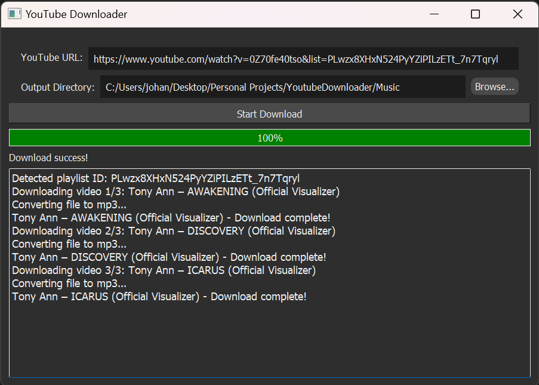

# YoutubeDownloader# YouTube Video to MP3 Downloader

A Python tool that downloads YouTube videos and playlists as `.mp3` files.



## Features
- Download YouTube videos and playlists
- Convert downloaded videos to MP3 format

## Requirements
Download from the Releases page for the executable file! No other step is necessary. 

Otherwise if you want to get the source code and run on your local machine:
- Python 3.x
- ffmpeg installed and in PATH environment variable (or specify path in download_video_as_mp3: 'ffmpeg_location')

## Setup
1. Clone the repo:
    ```bash
    git clone https://github.com/JohanLee2000/YoutubeDownloader.git
    cd youtube-downloader
    ```

2. Activate virtual environment:

    Windows:
    ```bash
    venv/Scripts/activate
    ```

    Mac/Unix:
    ```bash
    source venv/bin/activate
    ```
 

3. Install the dependencies:
    ```bash
    pip install -r requirements.txt
    ```

4. Run the script:
    ```bash
    python src/main.py
    ```

5. Enter the YouTube URL(Video or playlist):
    ```bash
    {URL}
    ```
    example: https://www.youtube.com/watch?v=8wWbYuYGT1k

6. Enter the output directory (where you want to store the downloaded files):
    ```bash
    {Path}
    ```
    example: 'Music' or Browse Directory

    It will then put the file inside the existing directory or create one if not.

## Disclaimer
This app is intended for personal use only. It is not intended for commercial purposes, distributing or sharing copyrighted material without proper authorization from the content owners or in violation of Youtube's terms of service.

By using this application you agree to use the downloaded content according to the copyright laws and regulations and accept full
responsibility for any misuse or violations.

The developers of this application shall not be held liable for any unauthorized or improper use of the downloaded content. Users are solely responsible for their actions and are encouraged to use this application responsibly and ethically.

## License
MIT License
